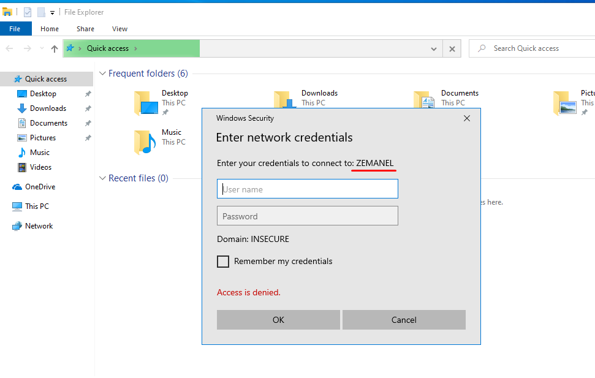
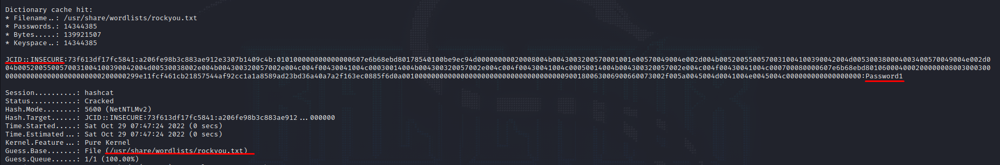

# 🛰 LLMNR

### Definição

**LLMNR** é um acrónimo de _Link-Local Multicast Resolution_, está activo por defeito e é usado para resolução de nomes quando não existe resposta do DNS ao pedido.

Na pratica é enviado, em ultimo recurso, um pedido para todo o segmento de rede onde a máquina se encontra na tentativa que o pedido seja respondido por alguem que consiga resolver o nome.

A vulnerabilidade deste serviço existe na resposta, sendo enviado o utilizador e a _hash_ da _password_ que pode assim ser extraida dependendo da complexidade da mesma.

É um ataque do tipo **Man in the Middle (MITM)**, em que o atacante responde ao pedido e guarda informação de acesso do utilizador.


1. O utilizador pretende aceder a uma pasta de rede inexistente com o nome \\\ZEMANEL;
2. O DNS falha em responder porque não conhece o recurso;
3. É enviado para a rede o mesmo pedido por LLMNR;
4. A maquina do atacante diz que tem o recurso localmente;
5. É enviado o _user_ e o _hash_ da _password_ para o atacante para que inicie a autenticação.

Desta forma o atacante fica com a possibilidade de extrair a _password_ do _hash_ que recebeu para se autenticar, iniciando assim o primeiro passo para acesso ao dominio.

### Exploração (PoC)

* Iniciar o _responder_

```Bash
sudo responder -I eth0 -wd
```


* o utilizador tenta aceder a uma pasta de rede que não existe.



* O _responder_ indica ao utilizador jcid dizendo que é ele o destino e é enviado o _user_ e a _hash_ da _password_


* Copiamos a hash para um ficheiro e iniciamos o processo de extração da _password_ a partir da _hash_.


* Iremos utilizar a ferramenta _**hashcat**_ para o efeito, existem outras opções como o **John the ripper**
* O tipo de _hash_ é NTLMV2


* ```bash

    hashcat -m 5600 jcid.hash /usr/share/wordlists/rockyou.txt

  ```



E a partir deste momento já conhecemos o user/dominio assim como a password do utilizador, neste ponto podemos iniciar a exploração da Active Directory, visto que já temos credenciais validas.

### Informação adicional

Este tipo de ataque é muito eficaz logo pelo manhã quando os utilizadores chegam ao local de trabalho e depois de almoço. Visto que nessa altura é quando estes começam a aceder a drives partilhadas e/ou a outros serviços.

### Mitigação

* Em _"Group Policy Editor" > Local Computer Policy > Computer Configuration > Administrative Templates > Network > DNS Client_ colocar _**"Turn OFF Multicast Name Resolution"**_ como _**enable**_.


