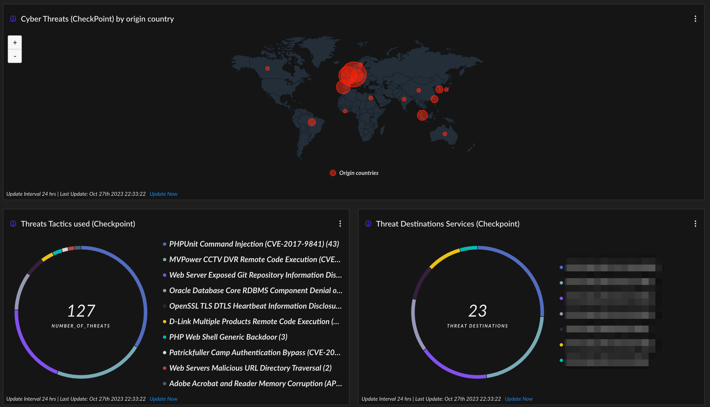

# Checkpoint

### Checkpoint



### Threats by origin country

```
dataset = check_point_smartdefense_raw 
| filter (cefSeverity = """Very-High""" and cs3 not in ("""anomaly""", """anomaly_dns""", """anomaly_http""")) 
| iploc src loc_country
| comp count(_id) as counter by loc_country
| view graph type = map xaxis = loc_country yaxis = counter default_limit = `false` seriescolor("counter","#ff2100") seriestitle("counter","Origin countries") 
```

### Threat Tactics

```
dataset = check_point_smartdefense_raw 
| filter (cefSeverity = """Very-High""" and cs3 not in ("""anomaly""", """anomaly_dns""", """anomaly_http""")) 
| comp count(_id) as Number_of_Threats by cs4
| sort desc Number_of_Threats 
| limit 10
| view graph type = pie xaxis = cs4 yaxis = Number_of_Threats 
```

### Threat Destination (Attack Surface)

```
dataset = check_point_smartdefense_raw 
| filter (cefSeverity = """Very-High""" and cs3 not in ("""anomaly""", """anomaly_dns""", """anomaly_http""")) 
| comp count(_id) as Threat_Destinations by dst
| sort desc Threat_Destinations 
| limit 10
| view graph type = pie xaxis = dst yaxis = Threat_Destinations headcolor = "#f5f4f4" legend_percentage = `true` seriestitle("Threat_Destinations","Threat Destinations") 
```
