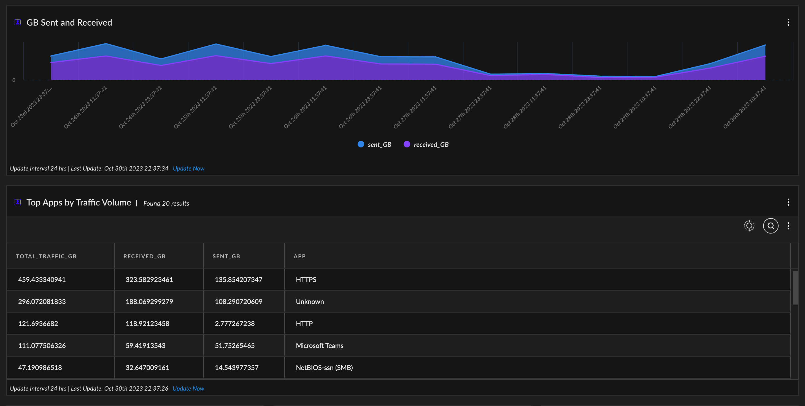
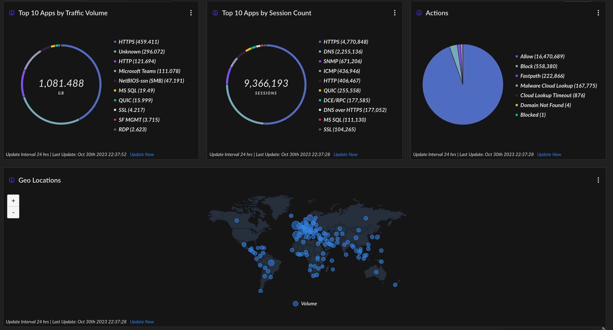
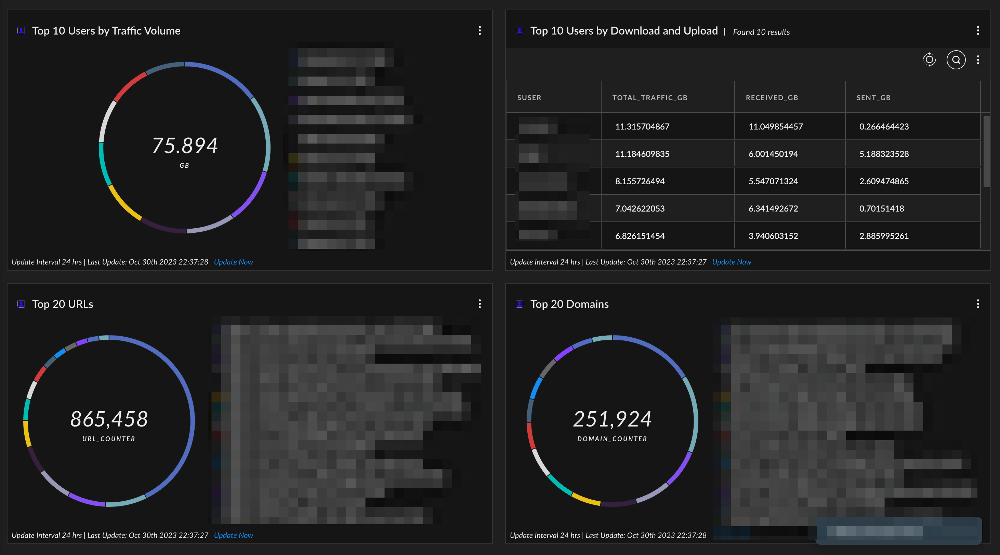
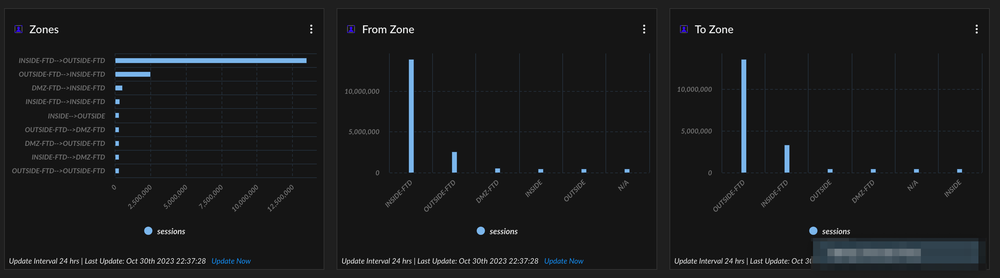

# FirepowerNetOps

   

## GB Sent and Received

```
dataset = cisco_firepower_raw
| filter cefName  ="CONNECTION STATISTICS"
| bin _time span =12h
| sort asc  _time 
| comp sum(bytesOut ) as sent, sum(bytesIn  ) as received by _time
| alter sent_GB = divide(sent, 1073741824), received_GB = divide(received, 1073741824) // 1073741824 = 1024^3
| view graph type = area subtype = stacked show_percentage = `false` xaxis = _time yaxis = sent_GB,received_GB  
```

## Top Apps by Traffic Volume

```
dataset = cisco_firepower_raw
| filter cefName  ="CONNECTION STATISTICS"
| alter total = add(bytesIn ,bytesOut)
| comp sum(bytesOut) as sent, sum(bytesIn) as received, sum(total) as total_traffic by app
| alter sent_GB = divide(sent, 1073741824), received_GB = divide(received, 1073741824), total_traffic_GB = divide(total_traffic , 1073741824) // 1073741824 = 1024^3
| sort desc total_traffic 
| fields total_traffic_GB , received_GB , sent_GB , app
| limit 20
```

## Top 10 Apps by Traffic Volume

```
dataset = cisco_firepower_raw
| filter cefName  ="CONNECTION STATISTICS"
| alter total = add(bytesIn ,bytesOut)
| comp sum(bytesOut) as sent, sum(bytesIn) as received, sum(total) as total_traffic by app
| alter sent_GB = divide(sent, 1073741824), received_GB = divide(received, 1073741824), total_traffic_GB = divide(total_traffic , 1073741824) // 1073741824 = 1024^3
| sort desc total_traffic 
| fields total_traffic_GB as GB , received_GB , sent_GB , app
| limit 10
| view graph type = pie xaxis = app yaxis = GB 
```

## Top 10 Apps by Session Count

```
dataset = cisco_firepower_raw
| filter cefName  ="CONNECTION STATISTICS" and app != "Unknown"
| comp count(_id) as sessions by app
| sort desc sessions 
| limit 10
| view graph type = pie xaxis = app yaxis = sessions 
```

## Actions

```
dataset = cisco_firepower_raw 
| fields act 
| comp count(_id ) as counter by act
| sort desc counter
| view graph type = pie subtype = full xaxis = act yaxis = counter 
```

## Geo Locations

```
dataset = cisco_firepower_raw 
| iploc  dst  loc_country
| filter loc_country != null
| union (dataset = cisco_firepower_raw | iploc src loc_country | filter loc_country != null) 
| comp count(_id) as counter by loc_country
| view graph type = map xaxis = loc_country yaxis = counter default_limit = `false` seriestitle("counter","Volume") 
```

## Top 10 Users by Traffic Volume

```
dataset = cisco_firepower_raw
| filter cefName  ="CONNECTION STATISTICS" and suser != "Unknown"
| alter total = add(bytesIn ,bytesOut)
| comp sum(bytesOut) as sent, sum(bytesIn) as received, sum(total) as total_traffic by suser 
| alter sent_GB = divide(sent, 1073741824), received_GB = divide(received, 1073741824), total_traffic_GB = divide(total_traffic , 1073741824) // 1073741824 = 1024^3
| sort desc total_traffic 
| fields total_traffic_GB as GB , received_GB , sent_GB , suser
| limit 10
| view graph type = pie xaxis = suser yaxis = GB   
```

## Top 10 Users by Download and Upload

```
dataset = cisco_firepower_raw
| filter cefName  ="CONNECTION STATISTICS" and suser != "Unknown"
| alter total = add(bytesIn ,bytesOut)
| comp sum(bytesOut) as sent, sum(bytesIn) as received, sum(total) as total_traffic by suser 
| alter sent_GB = divide(sent, 1073741824), received_GB = divide(received, 1073741824), total_traffic_GB = divide(total_traffic , 1073741824) // 1073741824 = 1024^3
| sort desc total_traffic 
| fields suser, total_traffic_GB , received_GB , sent_GB
| limit 10
```

## Top 20 URLs

```
dataset = cisco_firepower_raw 
| filter  cefName  contains "CONNECTION STATISTICS" and request != null and request not contains "microsoft" and request not contains "office365.com" and request not contains "google.com" and request not contains "rovensa.com" and request not contains "office.com" and request not contains "windows.com"
| comp count(_id) as url_counter by request 
|sort desc url_counter 
| limit 20
| view graph type = pie xaxis = request yaxis = url_counter 
```

## Top 20 Domains

```
dataset = cisco_firepower_raw 
| filter  cefName  contains "CONNECTION STATISTICS" and destinationDnsDomain  != null and destinationDnsDomain  not contains "microsoft" and destinationDnsDomain  not contains "opendns.com" and destinationDnsDomain  not contains "office365.com" and destinationDnsDomain  not contains "sapecgroup.com" and destinationDnsDomain  not contains "umbrella.com" and destinationDnsDomain  not contains "office.com" and destinationDnsDomain  not contains ".local"
| comp count(_id) as domain_counter by destinationDnsDomain  
|sort desc domain_counter
| limit 20
| view graph type = pie xaxis = destinationDnsDomain yaxis = domain_counter 
```

## Zones

```
dataset = cisco_firepower_raw 
| comp count(_id) as sessions by cs3, cs4 
| alter zones = concat(cs3 , "-->", cs4  )
| sort desc sessions 
| limit 10
| view graph type = column subtype = grouped layout = horizontal xaxis = zones yaxis = sessions 
```

## From Zone

```
dataset = cisco_firepower_raw 
| filter (cefName = "CONNECTION STATISTICS") 
| comp count(_id) as sessions by cs3 
| sort desc sessions  
| limit 10
| view graph type = column subtype = grouped xaxis = cs3 yaxis = sessions  
```

## To Zone

```
dataset = cisco_firepower_raw 
| filter (cefName = "CONNECTION STATISTICS") 
| comp count(_id) as sessions by cs4 
| sort desc sessions  
| limit 10
| view graph type = column subtype = grouped xaxis = cs4 yaxis = sessions  
```
