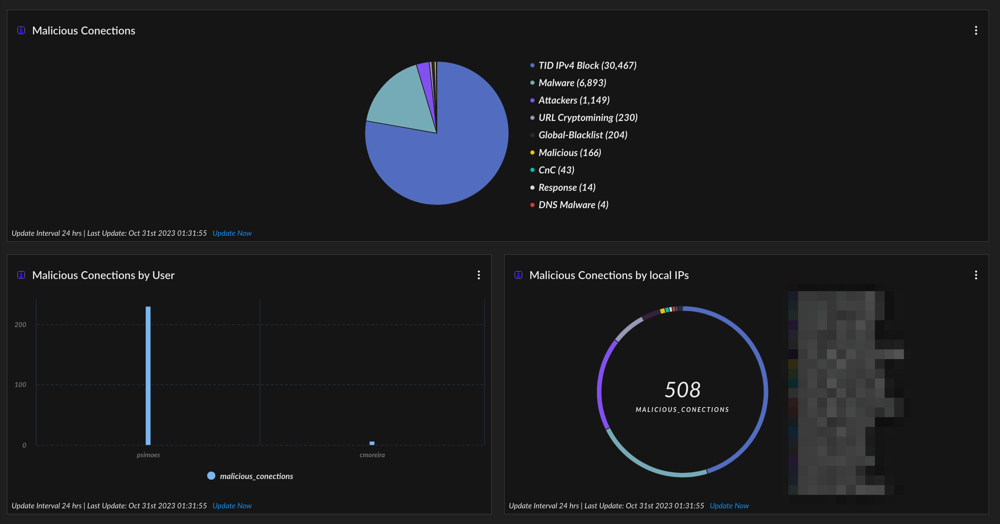
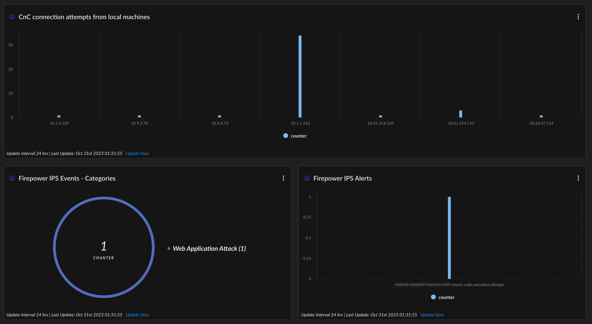
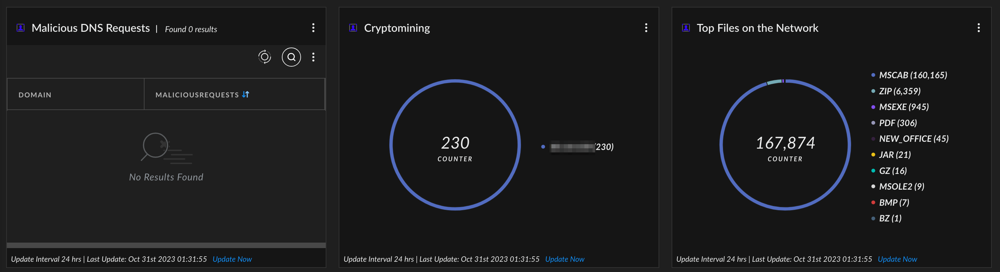

# FirepowerSecOps

  

## Malicious Conections

```
dataset = cisco_firepower_raw
| filter cefName  ="CONNECTION STATISTICS" and cs5 != null
| comp count(_id) as Counter by cs5 
| sort desc Counter
| view graph type = pie subtype = full xaxis = cs5 yaxis = Counter 
```

## Malicious Conections by User

```
dataset = cisco_firepower_raw
| filter cefName  ="CONNECTION STATISTICS" and cs5 != null and suser  != "Unknown"
| comp count(_id ) as malicious_conections by suser 
| sort desc malicious_conections 
| fields suser , malicious_conections
| view graph type = column subtype = grouped xaxis = suser yaxis = malicious_conections 
```

## Malicious Conections by local IPs

```
dataset = cisco_firepower_raw
| filter cefName  ="CONNECTION STATISTICS" and cs5 != null 
| alter local_range1 = incidr(src,"172.16.0.0/12")
| alter local_range2 = incidr(src,"192.168.0.0/16")
| alter local_range3 = incidr(src,"10.0.0.0/8")
| filter local_range1 = TRUE OR local_range2 = TRUE OR local_range3 = TRUE
| comp count(_id ) as malicious_conections by src 
| sort desc malicious_conections 
| limit 50
| fields src, malicious_conections
| view graph type = pie xaxis = src yaxis = malicious_conections 
```

## CnC connection attempts from local machines

```
dataset = cisco_firepower_raw
| filter cefName  ="CONNECTION STATISTICS" and cs5 = "CnC" 
| alter local_range1 = incidr(src,"172.16.0.0/12")
| alter local_range2 = incidr(src,"192.168.0.0/16")
| alter local_range3 = incidr(src,"10.0.0.0/8")
| filter local_range1 = TRUE OR local_range2 = TRUE OR local_range3 = TRUE
|comp count(_id) as counter by src
| view graph type = column subtype = grouped xaxis = src yaxis = counter 
```

## Firepower IPS Events - Categories

```
dataset = cisco_firepower_raw
| filter cefName  !="CONNECTION STATISTICS" and cs5Label = "ipsPolicy"
| comp count(_id) as counter by cat  
| sort desc counter 
| limit 15
| view graph type = pie xaxis = cat yaxis = counter 
```

## Firepower IPS Alerts

```
dataset = cisco_firepower_raw
| filter cefName  !="CONNECTION STATISTICS" and cs5Label = "ipsPolicy"
| comp count(_id) as counter by cefName  
| sort desc counter 
| limit 15
| view graph type = column subtype = grouped xaxis = cefName yaxis = counter 
```

## Malicious DNS Requests

```
dataset = cisco_firepower_raw
| filter cefName  ="CONNECTION STATISTICS" and cs5 = "DNS Response" 
| comp count(_id) as MaliciousRequests by destinationDnsDomain 
| sort desc MaliciousRequests 
| fields destinationDnsDomain as Domain, MaliciousRequests 
```

## Cryptomining

```
dataset = cisco_firepower_raw
| filter cefName  ="CONNECTION STATISTICS" and cs5 contains "Cryptomining" 
|comp count(_id) as counter by src
| view graph type = pie xaxis = src yaxis = counter 
```

## Top Files on the Network

```
dataset = cisco_firepower_raw
| filter cefName  !="CONNECTION STATISTICS" and fileType != null
| comp count(_id ) as counter by fileType 
| sort desc counter 
| limit 10
| view graph type = pie xaxis = fileType yaxis = counter 
```
