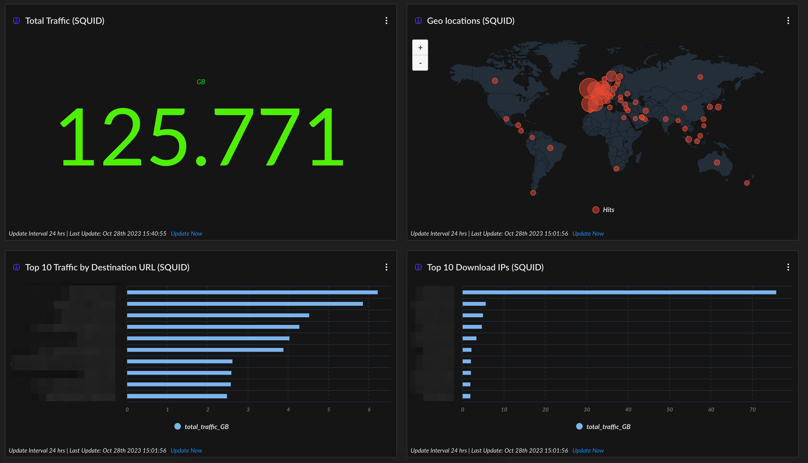

# Squid

### Squid Proxy



### Total traffic

```
dataset = unknown_unknown_raw
| filter (_reporting_device_ip = """192.168.10.26""") 
| alter bytes =  to_number(arrayindex(regextract(_raw_log , "(\d+)\s+CONNECT"),0)) 
| comp sum(bytes) as totalbytes
|alter total_traffic_GB = divide(totalbytes, 1073741824) // 1073741824 = 1024^3
|fields total_traffic_GB
| view graph type = single subtype = standard header = "GB" xaxis = total_traffic_GB yaxis = total_traffic_GB scale_threshold("#4fef01") headcolor = "#0ae204" 

```

### Geolocation

```
dataset = unknown_unknown_raw
| filter (_reporting_device_ip = """192.168.10.26""") 
| alter dst = arrayindex(regextract(_raw_log, "HIER_DIRECT/(\d+\.\d+\.\d+\.\d+)"),0 ) 
|filter dst != null 
| iploc dst loc_country
| comp count(_id) as counter by loc_country
| view graph type = map xaxis = loc_country yaxis = counter default_limit = `false` seriescolor("counter","#e84830") seriestitle("counter","Hits") 
```

### Destination Urls

```
dataset = unknown_unknown_raw
| filter (_reporting_device_ip = """192.168.10.26""") 
| alter url = arrayindex(regextract(_raw_log, "CONNECT\s+([a-zA-Z0-9.-]+)"),0 ) , 
   
    bytes =  to_number(arrayindex(regextract(_raw_log , "(\d+)\s+CONNECT"),0)) 
| comp sum(bytes) as totalbytes by url 
|sort desc totalbytes 
|alter total_traffic_GB = divide(totalbytes, 1073741824) // 1073741824 = 1024^3
|limit 10
|fields url , total_traffic_GB
| view graph type = column subtype = grouped layout = horizontal xaxis = url yaxis = total_traffic_GB 
```

### Top download IPs

```
dataset = unknown_unknown_raw
| filter (_reporting_device_ip = """192.168.10.26""") 
| alter  
    sourceip = arrayindex(regextract(_raw_log , "(\d{1,3}\.\d{1,3}\.\d{1,3}\.\d{1,3}) TCP_TUNNEL"),0), 
    bytes =  to_number(arrayindex(regextract(_raw_log , "(\d+)\s+CONNECT"),0)) 
| comp sum(bytes) as totalbytes by sourceip 
|sort desc totalbytes 
|alter total_traffic_GB = divide(totalbytes, 1073741824) // 1073741824 = 1024^3
|limit 10
|fields sourceip , total_traffic_GB
| view graph type = column subtype = grouped layout = horizontal xaxis = sourceip yaxis = total_traffic_GB 

```
