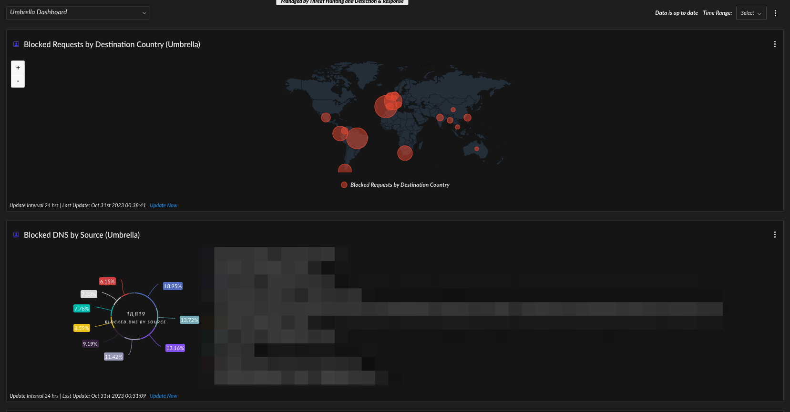
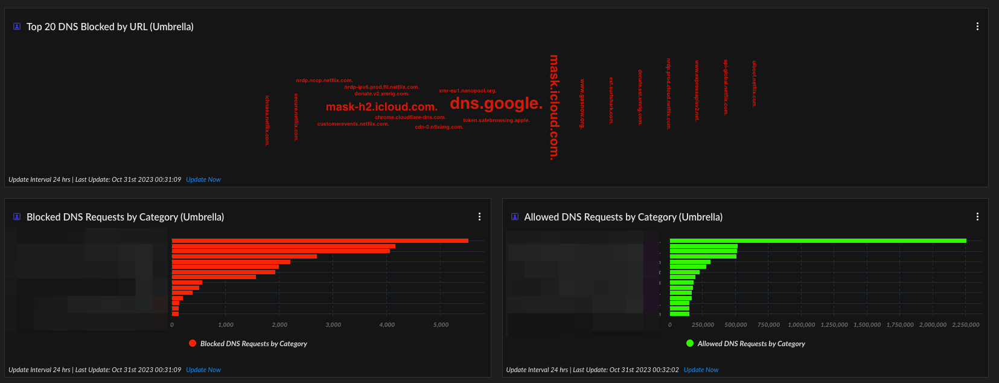

# Umbrella

 

## Blocked Requests by Destination Country (Umbrella)

```
dataset = amazon_aws_raw
| alter ips = arrayindex(regextract(_raw_log , "^(?:[^\"]*\"){9}([^\"]+)"),0), status = arrayindex(regextract(_raw_log , "^(?:[^\"]*\"){11}([^\"]+)"),0)
| filter status = "Blocked"
| filter ips != null 
| iploc ips loc_country
| comp count(_id) as counter by loc_country
| view graph type = map xaxis = loc_country yaxis = counter default_limit = `false` seriescolor("counter","#e84830") seriestitle("counter","Blocked Requests by Destination Country") 
```

## Blocked DNS by Source (Umbrella)

```
dataset = amazon_aws_raw
| alter users = arrayindex(regextract(_raw_log , "^(?:[^\"]*\"){5}([^\"]+)"),0), status = arrayindex(regextract(_raw_log , "^(?:[^\"]*\"){11}([^\"]+)"),0)
| filter status = "Blocked"
| comp count(_id) as Blocked_DNS_Requests by users 
| sort desc Blocked_DNS_Requests
| limit 10
| view graph type = pie show_callouts = `true` xaxis = users yaxis = Blocked_DNS_Requests seriestitle("Blocked_DNS_Requests","Blocked DNS by Source") 
```

## Top 20 DNS Blocked by URL (Umbrella)

```
dataset = amazon_aws_raw
| alter url = arrayindex(regextract(_raw_log , "^(?:[^\"]*\"){17}([^\"]+)"),0), status = arrayindex(regextract(_raw_log , "^(?:[^\"]*\"){11}([^\"]+)"),0)
| filter status = "Blocked"
| comp count(_id) as Blocked_DNS_Requests by url 
| sort desc Blocked_DNS_Requests
| limit 20
| view graph type = wordcloud xaxis = url yaxis = Blocked_DNS_Requests word_color = "#d20606" 
```

## Blocked DNS Requests by Category (Umbrella)

```
dataset = amazon_aws_raw
| alter Categories = arrayindex(regextract(_raw_log , "^(?:[^\"]*\"){19}([^\"]+)"),0), status = arrayindex(regextract(_raw_log , "^(?:[^\"]*\"){11}([^\"]+)"),0)
| filter status = "Blocked"
| comp count(_id) as Allowed_DNS_Requests by Categories 
| sort desc Allowed_DNS_Requests
| limit 15
| view graph type = column subtype = grouped layout = horizontal xaxis = Categories yaxis = Allowed_DNS_Requests seriescolor("Allowed_DNS_Requests","#f60b00") seriestitle("Allowed_DNS_Requests","Blocked DNS Requests by Category") 
```

## Allowed DNS Requests by Category (Umbrella)

```
dataset = amazon_aws_raw
| alter Categories = arrayindex(regextract(_raw_log , "^(?:[^\"]*\"){19}([^\"]+)"),0), status = arrayindex(regextract(_raw_log , "^(?:[^\"]*\"){11}([^\"]+)"),0)
| filter status = "Allowed"
| comp count(_id) as Allowed_DNS_Requests by Categories 
| sort desc Allowed_DNS_Requests
| limit 15
| view graph type = column subtype = grouped layout = horizontal xaxis = Categories yaxis = Allowed_DNS_Requests seriescolor("Allowed_DNS_Requests","#31f600") seriestitle("Allowed_DNS_Requests","Allowed DNS Requests by Category")  
```
