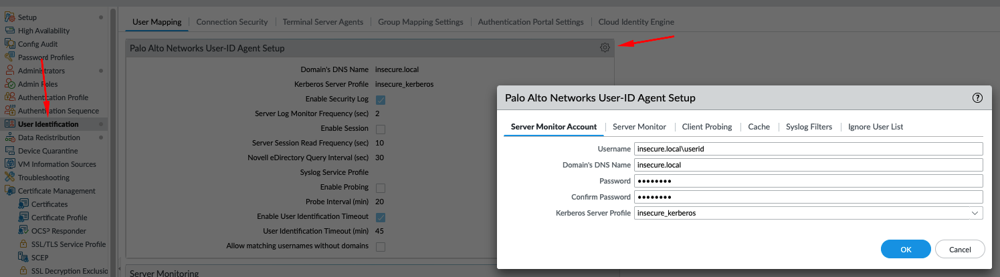
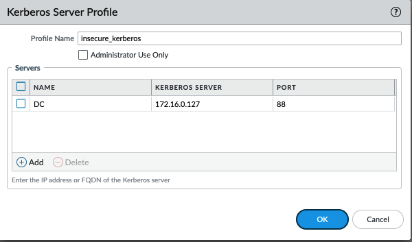
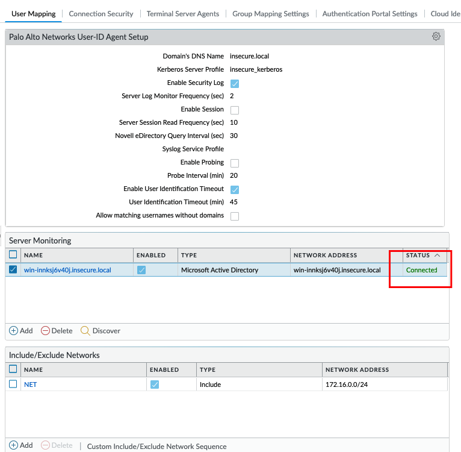
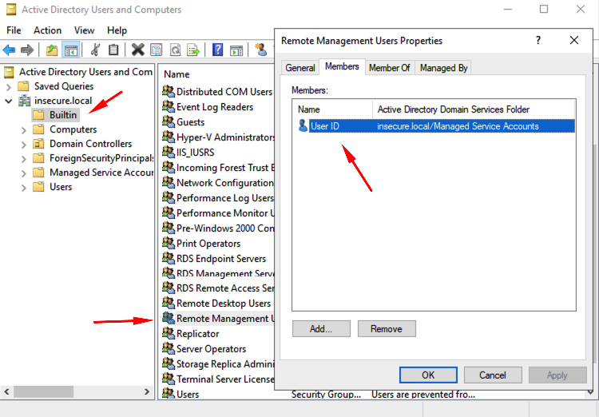

## Data Redistribution

## Create Service Account

**DO NOT SKIP THIS**
We must start to create a service account by following the official [documentation](https://docs.paloaltonetworks.com/pan-os/11-0/pan-os-admin/user-id/map-ip-addresses-to-users/create-a-dedicated-service-account-for-the-user-id-agent). 

## Retrieve UserID from Windows Active Directory Server

To Connect a PA Firewall to an existing active directory we must configure the UserID Agent Setup

**Device> User Identification> User Mapping**

Fill your domain information as follow:

- Username: your_domain\service_account
- Domains DNS Name: your domain name 
- Password: service account password
- Kerberos Server profile: create new

## Kerberos Server profile:

Choose a Profile name and declare your domain controllers that your Firewall can reach.

## Server Monitor

Chose type as Microsoft Active Directory and WINRM-HTTP as Transport protocol.

Network address is the FQDN of the server with AD Role.

**Tip**: if you Hit Discover on Server Monitor these will be populated automatically. 

If everything was setup correctly you should see Status **Connected**.

**IMPORTANT**

The service account user **MUST** be on Remote Management Users Builtin Group or you will get an **_Access Denied_** message.

